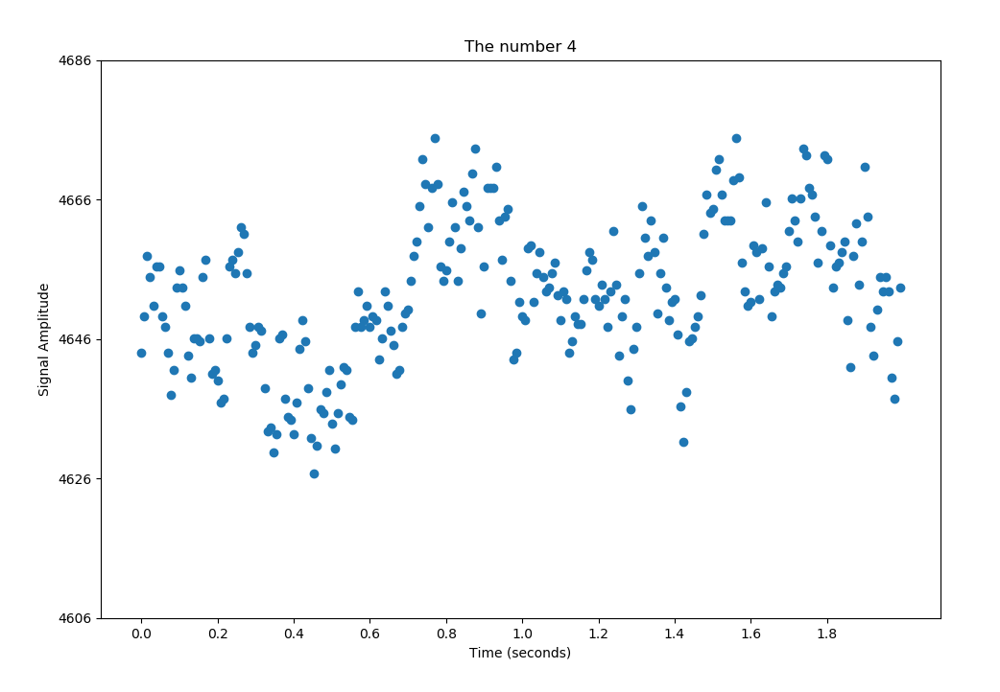

# EEG-Signal-Plotting-for-MNIST-Digits
Simple analysis and plotting of EEG brain signals from a person seeing MNIST digits.  Data set contains over 900,000 signals, fairly distributed among each digit.

You can find the data set here: http://mindbigdata.com/opendb/index.html (I am using the EPOC data for this code)

Format: 

Format: 

Format: 
