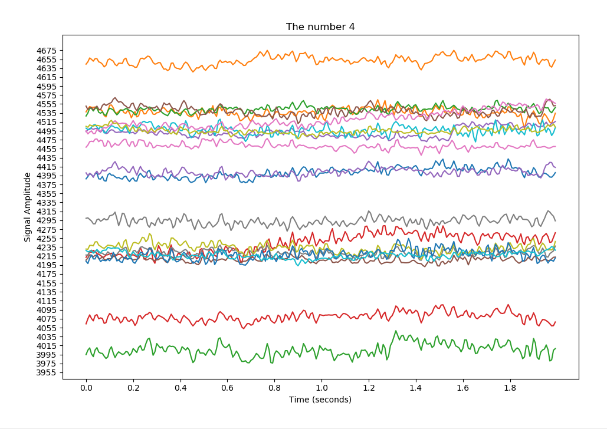

# EEG-Signal-Plotting-for-MNIST-Digits
Simple analysis and plotting of EEG brain signals from a person seeing MNIST digits.  Data set contains over 900,000 signals, fairly distributed among each digit.

You can find the data set here: http://mindbigdata.com/opendb/index.html (I am using the EPOC data for this code)

Below are plots for a random signal for the number 4, as well as a plot showing twenty different signals for the number 4 to compare. It's interesting to see the different signal amplitudes for the same number, and I was hoping to making see some definitive correlation, but there's a reason why our brains are so complex..

PLOT ONE: scatter of the signal data points

PLOT TWO: plot of the signal as a waveform (usual EEG signal style)

PLOT THREE: plot of the signal data points and the waveform together

PLOT FOUR: twenty different signals for the number 4

The comparison plot is actually quite interesting, and it's possible that there could be some correlation where the density of signals is much higher, showing more overlap and possibly allowing for better classification if you were to run this data set through a classification algorithm or a simple neural network.
